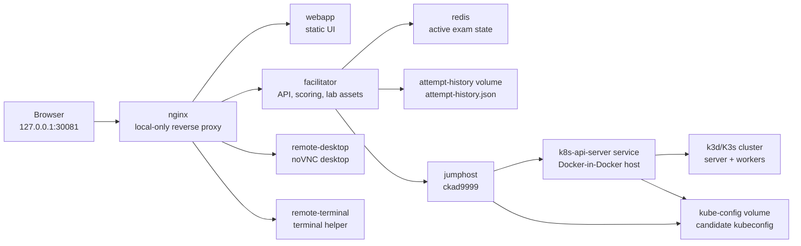

# CK-X Exam Simulator

CK-X is a local, Docker Compose based Kubernetes exam simulator for hands-on CKA,
CKAD, CKS, and custom Kubernetes practice labs.

This repository is currently tuned for local CKA practice on a Windows laptop
with Docker Desktop and WSL2. It provides an exam-style web UI, a remote desktop
workspace, Kubernetes access through `ckad9999`, automatic lab setup, automatic
validation, scoring, and persistent previous-attempt history.

CK-X is not an official CNCF, Linux Foundation, PSI, Killer.sh, or Kubernetes
project. It is an independent practice simulator.

## What Problem This Simulator Solves

Learning Kubernetes administration is hard because realistic practice requires
more than static YAML questions. A useful CKA practice environment needs:

- A timed exam-style interface.
- A terminal/desktop workspace similar to a remote exam workflow.
- A disposable Kubernetes cluster for each attempt.
- Setup scripts that create broken or incomplete cluster state.
- Validation scripts that score the final Kubernetes state.
- Repeatable labs that can be shared, improved, and regenerated.
- Persistent history so users can see previous scores and weak areas.

CK-X solves this by packaging the UI, backend, remote desktop, Kubernetes
cluster runtime, SSH workspace, Redis state, and attempt-history storage into one
local Docker Compose project.

## Current Status

The current stable version supports:

- Local web UI at `http://127.0.0.1:30081`.
- Local-only nginx entrypoint. Internal services are not published directly.
- CKA, CKAD, CKS, and Other lab categories from `labs.json`.
- Dynamic lab dropdown from `facilitator/assets/exams/labs.json`.
- Exam Mode UI with question panel, timer, pause/resume, VNC desktop, reconnect,
  fullscreen, flagging, mark-as-done, and final evaluation.
- Candidate Kubernetes access through `ssh ckad9999`.
- Control-plane practice helper through `ssh controlplane`.
- Kubectl alias and completion in the control-plane helper, including `k get no`
  and `k get dep`.
- Persistent Previous Attempts and Weak Areas history.
- Attempt history stored in a Docker volume at
  `/usr/src/app/data/attempt-history.json` inside the facilitator container.
- CKA lab authoring guide for AI tools:
  `docs/cka-lab-generation-guide.md`.

## Quick Start

Requirements:

- Docker Desktop with WSL2 enabled.
- Enough local resources for Docker Desktop. An 8 GB WSL memory limit can work,
  but 12 GB or more is more comfortable for heavier labs.

Start the simulator:

```bash
docker compose up -d --build
```

Open:

```text
http://127.0.0.1:30081
```

Check container status:

```bash
docker compose ps
```

View facilitator logs:

```bash
docker compose logs --tail=100 facilitator
```

Stop the simulator while preserving history:

```bash
docker compose down
```

Do not use this unless you intentionally want to delete persistent data:

```bash
docker compose down -v
```

## Main User Workflow

1. Open the web UI at `http://127.0.0.1:30081`.
2. Select a lab or mock exam from the dropdown.
3. Start the exam.
4. CK-X prepares the Kubernetes environment and downloads lab scripts into the
   candidate workspace.
5. Use the remote desktop terminal.
6. Connect to the candidate target if needed:

```bash
ssh ckad9999
```

7. Work with Kubernetes normally:

```bash
kubectl get nodes
kubectl get pods -A
k get no
k get dep
```

8. For simulated node-level practice, use:

```bash
ssh controlplane
ssh node01
ssh node02
```

9. Submit/evaluate the exam.
10. CK-X runs validation scripts, calculates the score, stores the result, and
    updates Previous Attempts / Weak Areas.

## Application Structure

High-level repository layout:

```text
ck-x/
|-- app/                 # Browser UI: landing page, exam page, JS, CSS
|-- facilitator/         # Backend API, lab registry, scoring, history
|-- jumphost/            # Candidate SSH host, hostname ckad9999
|-- kind-cluster/        # Current k3d/K3s cluster host and setup scripts
|-- nginx/               # Local-only reverse proxy
|-- remote-desktop/      # noVNC desktop environment
|-- remote-terminal/     # SSH terminal support service
|-- docs/                # User, developer, and lab-generation docs
|-- scripts/             # Helper/deployment scripts
`-- docker-compose.yaml  # Local simulator topology
```

Important lab asset paths:

```text
facilitator/assets/exams/labs.json
facilitator/assets/exams/cka/NNN/
facilitator/assets/exams/ckad/NNN/
facilitator/assets/exams/cks/NNN/
facilitator/assets/exams/other/NNN/
```

Each lab normally contains:

```text
config.json
assessment.json
answers.md
scripts/setup/
scripts/validation/
```

## Components And How They Connect



### nginx

`nginx` is the only externally exposed service. It binds to:

```text
127.0.0.1:30081
```

This keeps the simulator local to the laptop by default.

### webapp

`app/` serves the browser UI:

- Landing page.
- Lab selector.
- Previous Attempts / Weak Areas.
- Exam Mode page.
- Remote desktop iframe.
- Question navigation, timer, pause, flagging, and evaluation controls.

### facilitator

`facilitator/` is the backend controller for:

- Reading `labs.json`.
- Serving lab metadata and question data.
- Serving lab assets to the jumphost.
- Starting and ending exam environments.
- Running evaluation through the jumphost.
- Storing active exam state in Redis.
- Writing persistent attempt history to JSON.

The attempt history file is:

```text
/usr/src/app/data/attempt-history.json
```

It is backed by the Docker volume:

```text
attempt-history
```

### redis

Redis stores active exam/session status and current exam result data. It is not
the permanent attempt-history store.

### jumphost

`jumphost` is the candidate-facing SSH host. Its hostname is:

```text
ckad9999
```

The exam UI intentionally tells candidates to use:

```bash
ssh ckad9999
```

It contains candidate tools such as `kubectl`, shell aliases, and access to the
shared kubeconfig.

### kind-cluster / k8s-api-server

This service currently runs Docker-in-Docker and creates the Kubernetes cluster
using k3d/K3s.

The service name is historically `k8s-api-server`, but it is not a real
standalone Kubernetes API server container. It is the internal host used to
create and manage the k3d/K3s cluster.

### remote-desktop

`remote-desktop` provides the noVNC desktop shown in the exam page. The VNC
ports are internal only and are proxied through nginx.

## How Exam Simulation Works

### 1. Lab Registration

The landing page reads the lab list from:

```text
facilitator/assets/exams/labs.json
```

Each entry points to a lab asset folder such as:

```text
assets/exams/cka/004
```

### 2. Exam Start

When a user starts an exam:

- The facilitator creates an exam session.
- The facilitator stores exam metadata and status in Redis.
- The facilitator asks the jumphost to run `prepare-exam-env`.
- The remote desktop session is restarted for a clean workspace.

### 3. Cluster Preparation

The jumphost connects to the Kubernetes host service and runs:

```bash
env-setup <worker-count> <cluster-name>
```

The current implementation creates or reuses a k3d/K3s cluster.

The kubeconfig is written to the shared volume:

```text
/home/candidate/.kube/kubeconfig
/home/candidate/.kube/config
```

### 4. Lab Asset Preparation

The facilitator packages each lab's `scripts/` folder as `assets.tar.gz` at
facilitator startup.

The jumphost downloads the current lab assets from the facilitator, extracts
them to:

```text
/tmp/exam-assets
```

Then it runs every setup script:

```bash
/tmp/exam-assets/scripts/setup/q*_setup.sh
```

Setup scripts create namespaces, broken resources, incomplete objects, and any
candidate working directories under `/tmp/exam`.

### 5. Candidate Solves Tasks

The candidate works in the VNC desktop and shell using `kubectl`.

Normal Kubernetes commands should work:

```bash
kubectl get nodes
kubectl get pods -A
kubectl -n <namespace> get all
```

### 6. Evaluation

When the user submits the exam:

- The facilitator asks the jumphost to run validation scripts.
- Each validation script checks one part of the required final state.
- Exit code `0` means pass.
- Non-zero exit code means fail.
- Scores are calculated from validation `weightage`.
- The final result is stored in Redis.
- A minimal persistent attempt record is appended to attempt history.

### 7. Previous Attempts And Weak Areas

The landing page reads:

```text
/facilitator/api/v1/exams/attempts
```

The API returns:

- Attempt history.
- Summary.
- Filters.
- Weak concepts.
- Failed questions.
- Failed validation steps.
- History file metadata.

This lets users review past scores and identify weak areas across local
practice attempts.

## Creating Custom CKA Labs

Use the dedicated AI/tooling guide:

```text
docs/cka-lab-generation-guide.md
```

Core rules:

- New CKA labs must be written under:

```text
facilitator/assets/exams/cka/NNN/
```

- Scan existing folders first and choose the next unused zero-padded folder.
- Do not overwrite existing labs without explicit confirmation.
- Update:

```text
facilitator/assets/exams/labs.json
```

- Use:

```json
"machineHostname": "ckad9999"
```

- Total validation weightage must equal exactly `100`.
- Every question should have 2 to 5 validation scripts.
- Do not manually commit `assets.tar.gz`.

Current CKA folders may include:

```text
001
002
003
004
007
```

If those folders exist, the next lowest unused folder is normally:

```text
005
```

## Current Limitations

This section is important for anyone creating CKA content.

### k3d/K3s, Not kubeadm

The current runtime uses k3d/K3s. It is excellent for fast local Kubernetes
practice, but it is not the same as a kubeadm-created cluster.

This means CK-X currently should not be used for real versions of these tasks:

- Real `kubeadm upgrade`.
- Real `kubeadm init`.
- Real `kubeadm join`.
- Real kubeadm certificate renewal.
- Real Kubernetes certificate authority repair.
- Real etcd restore of the live control plane.
- Real editing of kubeadm static pod manifests under
  `/etc/kubernetes/manifests`.
- Real troubleshooting of kubeadm component manifests.
- Real container runtime migration.
- Real multi-control-plane HA operations.

You can still create simulated command-writing or diagnostic versions of those
questions, but they must be worded honestly as simulations.

Example of an acceptable simulated task:

```text
Create `/tmp/exam/q7/upgrade-plan.sh` containing the commands an administrator
would run to inspect a kubeadm upgrade from v1.32.x to v1.33.x. Do not execute
the upgrade.
```

Example of a task to avoid in the current backend:

```text
Upgrade the real cluster from v1.32 to v1.33 using kubeadm.
```

### Control-Plane Access Is A Helper

The command below works:

```bash
ssh controlplane
```

But it enters a simulated k3d/K3s node container. It is not a full kubeadm
control-plane VM.

Useful K3s-style paths may exist:

```text
/etc/rancher/k3s/k3s.yaml
/var/lib/rancher/k3s/server/tls
```

Do not assume kubeadm paths naturally exist:

```text
/etc/kubernetes/admin.conf
/etc/kubernetes/pki
/etc/kubernetes/manifests
```

### Local Laptop Resource Limits

The simulator runs several containers plus a nested Kubernetes cluster. Heavy
mock exams may be slow on laptops with limited memory or CPU.

Safe current design target:

- 1 control-plane-like k3d server.
- 1 to 2 workers.
- Local-only UI/API.
- No unnecessary public ports.

### Not A Guarantee Of Exam Readiness

CK-X can provide strong practice, but exam readiness still depends on:

- Current official CKA curriculum.
- Real command speed.
- Debugging skill.
- Familiarity with official exam constraints.
- Practicing on kubeadm-style environments for cluster maintenance topics.

## Security Notes

This simulator is intended for local use.

Current local security posture:

- nginx is bound to `127.0.0.1:30081`.
- Internal service ports are exposed only on the Docker network.
- Redis is internal only.
- VNC is internal only and proxied by nginx.
- The facilitator attempt-history file is stored in a local Docker volume.
- Some containers are privileged because nested Kubernetes and desktop
  simulation require it.

Do not expose this Compose stack directly to the public internet.

## Backing Up And Resetting Attempt History

History lives inside the facilitator container at:

```text
/usr/src/app/data/attempt-history.json
```

It is backed by the Docker volume:

```text
attempt-history
```

To back it up, copy the file from the running facilitator container:

```bash
docker compose cp facilitator:/usr/src/app/data/attempt-history.json ./attempt-history-backup.json
```

To reset history, stop the app and remove only the history file or replace it
with:

```json
{
  "version": 1,
  "attempts": []
}
```

Do not run `docker compose down -v` unless you intentionally want to remove
Docker volumes.

## How To Improve This Project For CKA-Ready Practice

The current project is good for:

- Workloads.
- Scheduling.
- Services.
- Networking.
- Storage.
- RBAC.
- Most kubectl troubleshooting.
- Many realistic broken-resource scenarios.
- Local score tracking and weak-area review.

To become more CKA-ready for advanced cluster administration, the next major
improvement is a kubeadm-based backend.

## Next Upgrade Plan: kubeadm Backend

Goal:

Build an optional kubeadm cluster backend with 2 nodes:

- `controlplane`
- `node01`

The first version should be optimized for local Docker Desktop / WSL2.

### Phase 1: Preserve The Stable k3d Backend

Do not remove k3d immediately. Add a cluster-driver concept:

```text
CLUSTER_DRIVER=k3d
CLUSTER_DRIVER=kubeadm
```

Default should remain `k3d` until kubeadm is stable.

### Phase 2: Build A kubeadm Proof Of Concept

Create an isolated POC before wiring it into exams:

- One control-plane node.
- One worker node.
- `containerd`.
- `kubelet`.
- `kubeadm`.
- `kubectl`.
- CNI plugin.
- Working `kubectl get nodes`.
- Working `ssh controlplane`.
- Working `ssh node01`.

The POC must prove:

```bash
kubectl get nodes
kubectl get pods -A
ssh controlplane
ssh node01
```

### Phase 3: Optimize For Local Laptop Use

Optimization targets:

- Pre-pull Kubernetes images.
- Cache packages in image build where possible.
- Avoid downloading heavy dependencies during every exam start.
- Keep worker count low by default.
- Use resource limits that do not break kubelet.
- Document required Docker Desktop memory and CPU.

### Phase 4: Integrate With Existing CK-X Flow

The kubeadm backend must keep the existing app contracts:

- Same landing page.
- Same exam start API.
- Same exam status flow.
- Same `labs.json`.
- Same setup and validation script model.
- Same Previous Attempts history.
- Same localhost-only nginx entrypoint.

Only the cluster preparation and node-access backend should change.

### Phase 5: Enable Real Cluster Maintenance Labs

After kubeadm is stable, CK-X can support real versions of advanced CKA tasks:

- kubeadm upgrade practice.
- Certificate inspection and renewal.
- Static pod manifest troubleshooting.
- kubelet configuration troubleshooting.
- etcd snapshot and restore practice.
- Node join/drain/uncordon workflows.
- Control-plane component troubleshooting.

### Phase 6: Add Quality Gates

Before marking the kubeadm backend stable:

- End-to-end exam start test.
- `kubectl get nodes` from candidate shell.
- `ssh controlplane` test.
- `ssh node01` test.
- CoreDNS running.
- CNI healthy.
- Setup scripts run.
- Validation scripts run.
- Previous Attempts still records results.
- `docker compose down` and `docker compose up -d` do not delete history.
- No new public ports.

## Development And Validation Commands

Validate Docker Compose:

```bash
docker compose config
```

Check service status:

```bash
docker compose ps
```

Check logs:

```bash
docker compose logs --tail=100 facilitator
docker compose logs --tail=100 nginx
docker compose logs --tail=100 redis
docker compose logs --tail=100 k8s-api-server
```

Check web endpoints:

```bash
curl http://127.0.0.1:30081
curl http://127.0.0.1:30081/facilitator/api/v1/assements/
curl http://127.0.0.1:30081/facilitator/api/v1/exams/attempts
```

Validate JavaScript syntax:

```bash
node --check app/public/js/index.js
node --check app/public/js/exam.js
node --check facilitator/src/controllers/examController.js
node --check facilitator/src/services/jumphostService.js
node --check facilitator/src/services/attemptHistoryService.js
```

Validate CKA lab JSON and scoring using the commands in:

```text
docs/cka-lab-generation-guide.md
```

## Recommended Current Use

Use the current simulator for:

- Daily CKA kubectl speed practice.
- Scenario-based workload troubleshooting.
- RBAC, scheduling, networking, storage, and service repair practice.
- Custom CKA lab generation with AI tools.
- Score tracking and weak-area review.

For full CKA readiness, combine CK-X with:

- Official Kubernetes documentation practice.
- A kubeadm-based practice environment for cluster lifecycle topics.
- Timed mock exams.
- Manual repetition of weak areas shown by Previous Attempts.

## Documentation Index

Important docs:

- `docs/cka-lab-generation-guide.md`: strict guide for generating CKA labs with
  AI tools.
- `docs/how-to-add-new-labs.md`: older general lab contribution guide.
- `validation-report.md`: local validation notes and health-check history.
- `docs/development-setup.md`: development setup notes.
- `docs/local-setup-guide.md`: local setup notes.

## License

This project is licensed under the MIT License. See `LICENSE`.
